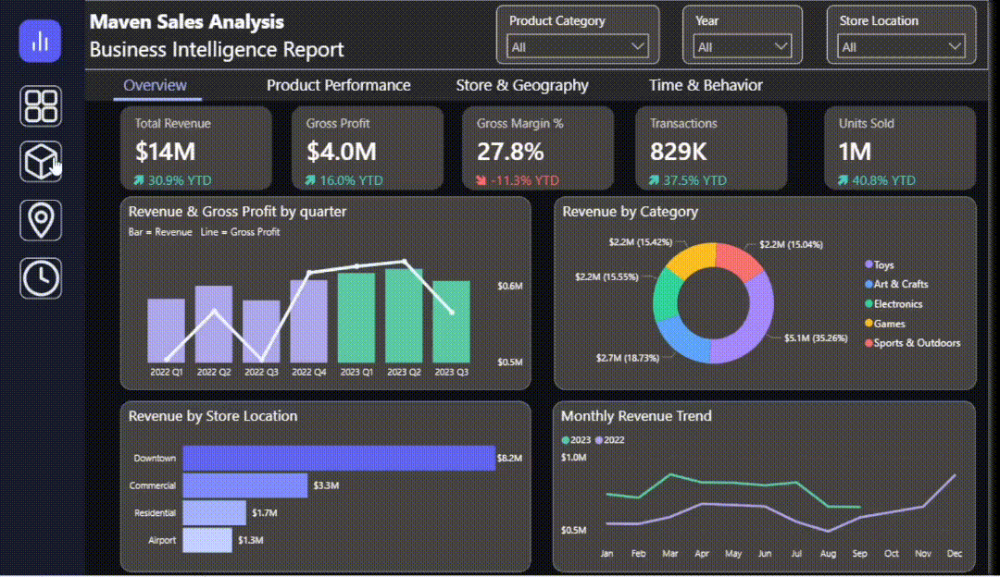
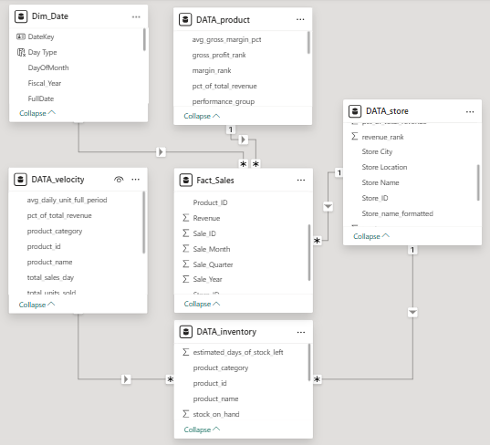
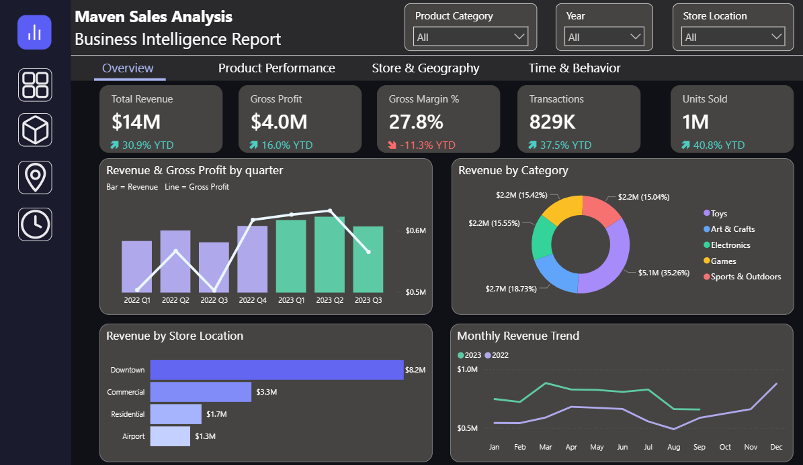
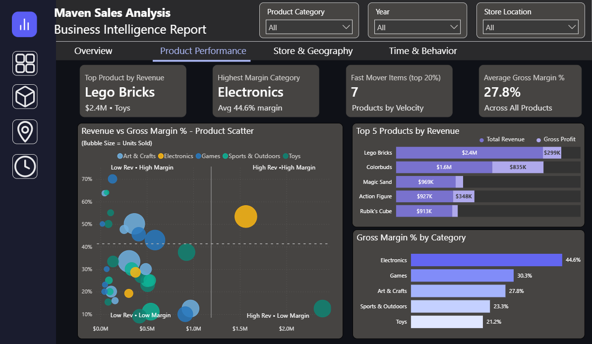
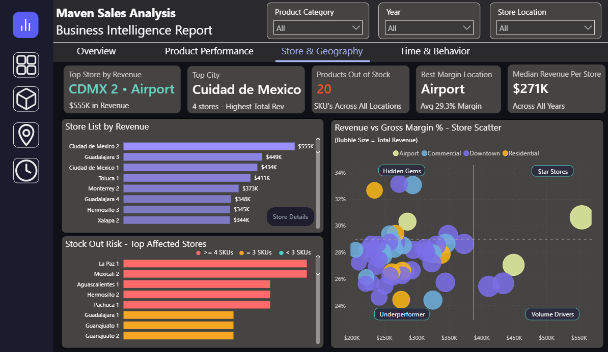
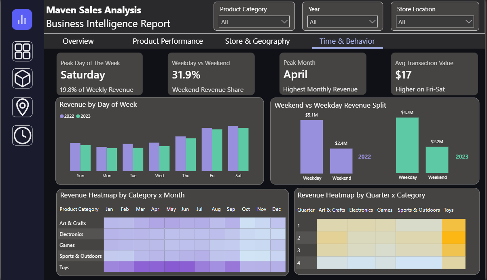
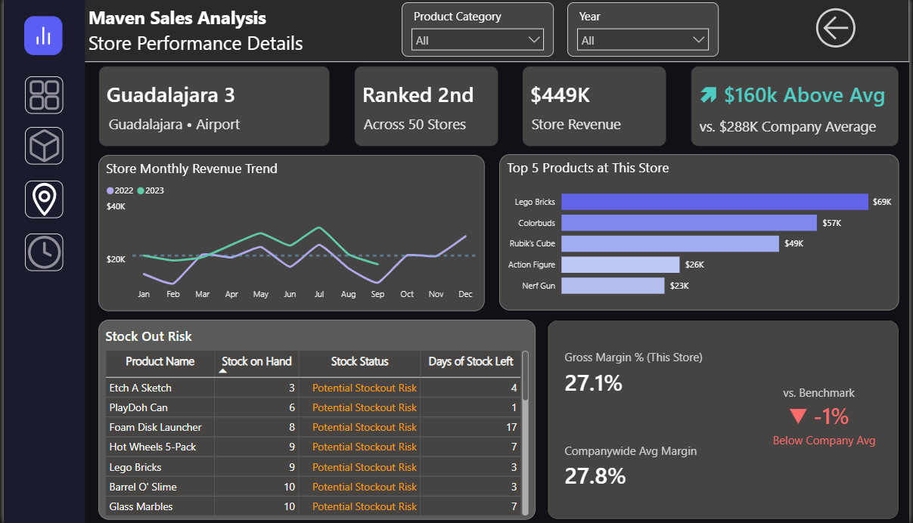

# Maven Toys Sales Analysis
### End-to-end sales & inventory analysis of Maven Toys (Mexico) using SQL and Power BI



---

## Project Overview

Maven Toys operates 50 retail stores across Mexico spanning four location formats. This project analyzes sales performance across 2022 and 2023 (Jan–Sep), built on ~829K transaction records covering $14M in total revenue, 829K transactions and 1M units sold.

The goal was not just building a dashboard, but also to find where the business is growing, where it's losing margin and what it should do about it. The analysis uncovered a clear tension — strong volume growth is masking a profitibility problem. This analysis traces it back to specific products, store formats and seasonal blind spots to address it.

The full findings are documented in the [Business Intelligence Report](Maven%20Sales%20Analysis%20Business%20Report.pdf).

---

## Dataset

Source: [Maven Analytics Data Playground](https://mavenanalytics.io/data-playground/mexico-toy-sales)

| Table | Rows | Description |
|-------|------|-------------|
| sales | ~829K | Transaction-level records with date, store, product, units and revenue |
| products | 35 | Product catalog with cost and retail price |
| stores | 50 | Store metadata including name, city and location format |
| inventory | ~1,500 | Stock on hand per product per store |

The sales table is the fact table at transaction grain. SQL was used to clean, aggregate and model this into a star schema before loading into Power BI.

---

## Key Business Insights

**1. Revenue grew 30.9% but margin fell 11.3%**

Maven matched its entire 2022 revenue in just 9 months of 2023. But gross margin dropped from 29.3% to 26.2%. The growth is real but the profitability isn't keeping up.

> Shift product mix toward higher margin categories before the gap widens further.

**2. Toys drives volume, Electronics drives margin**

Toys accounts for 35.26% of revenue but carries only 21.2% margin. Electronics sits at 15.55% revenue share but leads margin at 44.6%. The company's biggest category is also its least profitable one.

> Electronics needs a deliberate growth strategy, not just shelf space.

**3. Colorbuds is the most balanced product in the entire portfolio**

Lego Bricks gets all the attention at $2.4M revenue but only returns $299K in gross profit. Colorbuds sits at $1.56M revenue with $835K gross profit and a 53.4% margin. It is the only product in the High Rev, High Margin quadrant.

> Colorbuds deserves hero product treatment.

**4. Airport stores are Maven's most efficient format and nobody is talking about it**

4 Airport stores generate $1M revenue at 29.3% margin, the best margin of any format. Their secret is a naturally Electronics-heavy product mix and a less price sensitive customer base.

> Study the Airport model before expanding more Downtown locations.

**5. Día del Niño explains the April-June sales surge**

The Toys heatmap peaks from March through June every year. This maps directly onto Día del Niño (April 30), one of Mexico's biggest retail events which generated $1.9B nationally in 2024. This is predictable and plannable.

> Start building Toys inventory in February. Stores that stock out early don't recover those sales.

**6. High revenue rank doesn't mean a store is healthy**

Guadalajara 3 is ranked 2nd across 50 stores at $449K revenue but sits 1% below company margin average and has 7 products at stockout risk including its own top seller Lego Bricks with 3 days of stock left.

> Revenue rank alone is not enough. Margin and stock health need equal attention.

---

## Tools & Technologies

| Tool | Purpose |
|------|---------|
| **MS SQL Server** | Data cleaning, exploration and aggregation |
| **Power BI** | Interactive dashboard, 5 pages with cross-filtering and Drill Down features |
| **DAX** | Numerous custom measures for Revenue, Gross Margin, YTD growth, YoY profit etc|
| **Power Query** | Data transformation, modeling and relationship management |

---

## Data Model



The model follows a star schema core with `Fact_Sales` at the center, connected to `Dim_Date`, `DATA_product` and `DATA_store` via many-to-one relationships. Two supplementary tables `DATA_inventory` and `DATA_velocity` extend the model through `DATA_store` to support stockout risk and product velocity analysis independently of the sales fact table.

- **Dim_Date** — date spine with fiscal year, day type and month fields enabling time intelligence across the dashboard
- **DATA_product** — product attributes enriched with calculated columns (margin %, revenue rank, performance group) for scatter plot and ranking visuals
- **DATA_store** — store metadata including city, location format and formatted name, linked to both `Fact_Sales` and `DATA_inventory`
- **DATA_inventory** — stock snapshot per product per store, with estimated days of stock remaining powering the stockout risk visuals
- **DATA_velocity** — pre-aggregated product velocity table (daily sales rate, total units, revenue share) used in fast and slow mover analysis, connected to `DATA_inventory` via `product_id`

All five relationships are active, single-direction many-to-one. Filter context flows from dimension tables into `Fact_Sales`, keeping cross-filtering predictable across all dashboard pages.

---

## Repo Structure
```
Maven-Toys-Analysis/
│
├── Dashboard/
│   ├── Maven_Toys_Analysis.pbix
|   ├── Dashboard_Preview.gif
│   └── Screenshots/
│       ├── 01_Overview.png
│       ├── 02_Product_Performance.png
│       ├── 03_Store_Geography.png
│       ├── 04_Time_Behavior.png
│       ├── 05_Store_Details.png
│       └── Relationship_model.png
│
├── SQL Queries/
│   ├── Base_Sales_View_with_Profit.sql
│   ├── Data_Exploration_and_Quality.sql
│   ├── Dim_date.sql
│   ├── Fact_Sales.sql
│   ├── Inventory_Snapshot.sql
│   ├── Monthly_Performance.sql
│   ├── Product_Performance_Ranking.sql
│   ├── Sales_Velocity_Fast_Slow_Movers.sql
│   ├── Store_Performance_Ranking.sql
│   ├── Weekday_Weekend_Performance.sql
│   └── Yearly_Category_Performance.sql
│
├── Maven_Sales_Analysis_Report.pdf
└── README.md
```
---

## Dashboard Screenshots

### Overview

> Company-wide KPIs, quarterly revenue vs gross profit trend, revenue by store location and category, and monthly comparison between 2022 and 2023.

### Product Performance

> Revenue vs margin scatter plot, top 5 products by revenue and gross profit, gross margin % ranking by category.

### Store & Geography

> Store revenue ranking, Star vs Underperformer scatter, stockout risk by store. Drill through enabled to individual store detail pages.

### Time & Behavior

> Revenue by day of week, weekend vs weekday split, monthly revenue trend and category heatmaps by month and quarter.

### Store Details

> Individual store deep dive with monthly trend, top 5 products, stockout risk table and margin vs company benchmark.

---

## What I Learned

This project taught me that the most important skill in analytics isn't building the dashboard, it's knowing what question to ask next. The margin decline story wasn't obvious from the headline numbers. It took layering product mix data, store format filters and external seasonal context together before it made sense.

A few specific things I got better at through this project. Writing SQL queries that actually serve a business question rather than just pulling data. Building Power BI visuals that guide the reader toward a conclusion rather than dumping everything on one page. And researching external context like **Día del Niño** and **El Buen Fin** to validate what the data was showing rather than just describing it.

The drill through to Store Details was also a deliberate design choice. Revenue rank alone doesn't tell the whole story and I wanted the dashboard to make that obvious to anyone using it.

---

## Links

- **Business Intelligence Report** — [Maven_Sales_Analysis_Report.pdf](Maven%20Sales%20Analysis%20Business%20Report.pdf)
- **Power BI File** — [Maven_Toys_Analysis.pbix](Dashboard/Maven_Toys_Analysis.pbix)
- **Dataset Source** — [Maven Analytics Data Playground](https://mavenanalytics.io/data-playground/mexico-toy-sales)

---

*Prepared by Pallab Dey*
